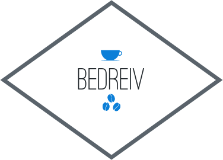

# BEDREIV
Thema 1.4 - Leertaak 3
 - Roelof Kallenkoot
 - Iris Meijer
 - Kevin Lankhuizen
 - Thijs Kuilman



## HOE DAN?

Je hebt [Composer](https://getcomposer.org/) nodig.

Als je rare errors krijgt over [Slim](http://www.slimframework.com) of hij doet het gewoon helemaal niet, run ```composer update``` of ```composer install```

Om te testen heb je php nodig, een lokale php development server kun je met ```php -S localhost:8000``` gebruiken.
Je zou het ook met apache / nginx of w/e kunnen doen.
*voordeel aan ```php -S``` is dat je in je console direct de request logs hebt.

## Workflow

Handigste voor ons is om in aparte branches te werken.

Gebruik een *somewhat logische* branchnaam, bijvoorbeeld je naam en de feature waar je aan werkt. bijv: ```roelof_incidenten_overzicht```

Submit deze branch als een Pull request zodat we deze als groep kunnen reviewen. Eventuele verbeteringen kunnen we dan als groep ook op deze branch uitvoeren.

## License

Hier moeten we het maar een keer over hebben ( MIT ofzo ) , anyways
copyright 2k15 wij vieren